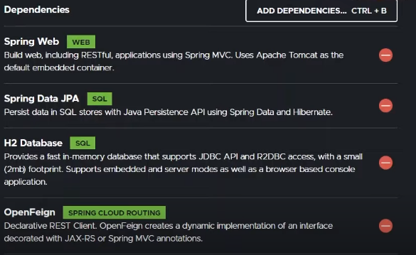

### Pequenos exemplos de padrões de projeto: ```Singleton, Strategy e Facate``` e uma API em ```Spring``` fazendo as comparações de suas anotações com esses três padrões.

   

### Dependências Spring:

<p align="center"></p>

### Associação entre o ```Spring Framework``` e os 3 padrões acima:

<p align="center"></p>
